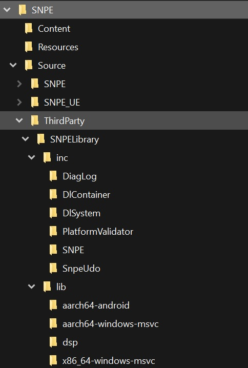

# Qualcomm™ NPE Plugin 

Qualcomm™ Game Studios developed Qualcomm™ NPE Plugin, which integrates Qualcomm's Neural Processing SDK to Unreal Engine and provides C++ and blueprint functionality to load, DLC models and run inference with them using either CPU, GPU or the device's HTP.

### Instructions

1. Clone or download the plugin ("SNPE")
2. Copy the plugin to the project's plugin folder.
3. Download Qualcomm's Neural Processing SDK from [Qualcomm™ Neural Processing SDK](https://developer.qualcomm.com/software/qualcomm-neural-processing-sdk) , Make sure to download the Windows and Linux version and selecting a version higher or equal to 2.14
4. From the installed Neural Processing SDK directory **copy** the contents of *"\AIStack\SNPE\[version]\include\SNPE"* to *"[project path]\plugins\SNPE\Source\ThirdParty\SNPELibrary\inc"*
5. To build for Android. From the installed Neural Processing SDK directory:
	**- copy** the folder of *"\AIStack\SNPE\[version]\include\lib\aarch64-android"* to *"[project path]\plugins\SNPE\Source\ThirdParty\SNPELibrary\lib\"*
6. For the windows x86-64 build (and the editor), From the installed Neural Processing SDK directory:
	**- copy** the contents of *"\AIStack\SNPE\[version]\include\lib\x86_64-windows-msvc"* to *"[project path]\plugins\SNPE\Source\ThirdParty\SNPELibrary\lib\"*
7. For the windows ARM64 build and Windows on Snapdragon systems, From the installed Neural Processing SDK directory:
	**- copy** the contents of *"\AIStack\SNPE\[version]\include\lib\aarch64-windows-msvc"* to *"[project path]\plugins\SNPE\Source\ThirdParty\SNPELibrary\lib\"*
	**- copy** the files *msvcp140.dll* and *vcruntime140.dll* (this must be supplied with your VS installation) to *"[project path]\plugins\SNPE\Source\ThirdParty\SNPELibrary\lib\aarch64-windows-msvc\"*
8. To run on DSP, HTP you need to **copy** the content of the specific library of your device to *"[project path]\plugins\SNPE\Source\ThirdParty\SNPELibrary\lib\dsp\"* those can be *"\AIStack\SNPE\[version]\include\lib\[hexagon-v73 | hexagon-v68 | hexagon-v66]"*. But if you are not sure of the model you can copy the content of the 3 directories.
9. Your *"[project path]\plugins\SNPE\Source\ThirdParty\SNPELibrary\lib\"* must now look like:  

More information can be found at [SNPE UE plugin blueprint reference.pdf](https://github.com/quic/snapdragon-game-plugins-for-unreal-engine/blob/engine/5.3/Plugins/SNPE/SNPE%20UE%20plugin%20blueprint%20reference.pdf).

# License

Snapdragon™ Game Super Resolution is licensed under the BSD 3-clause “New” or “Revised” License. Check out the [LICENSE](LICENSE) for more details.