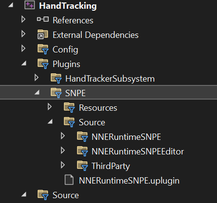
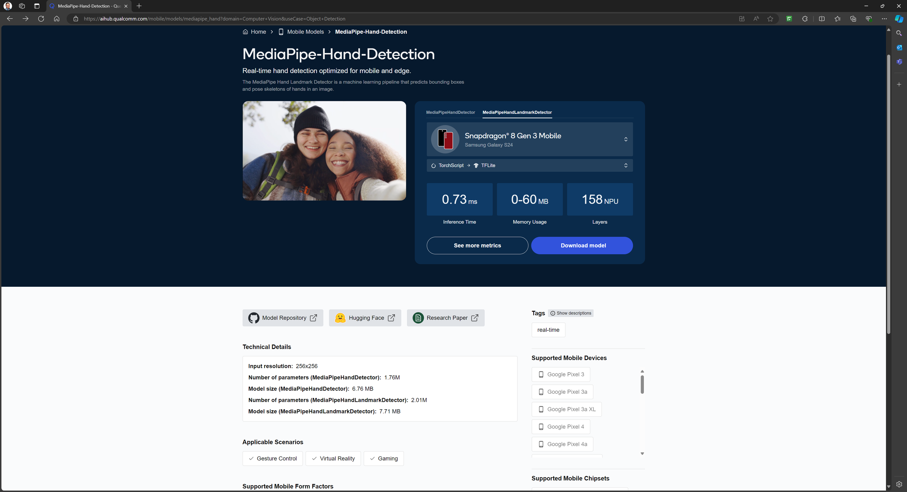
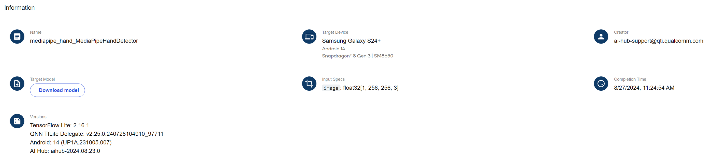
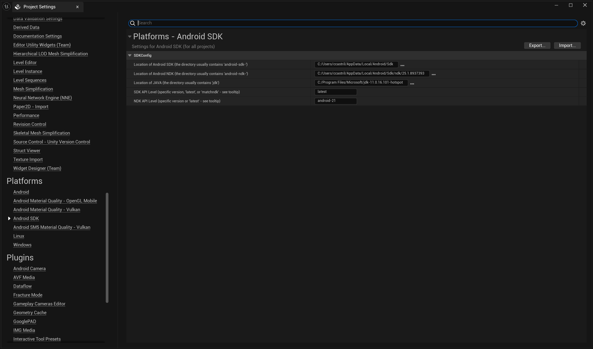
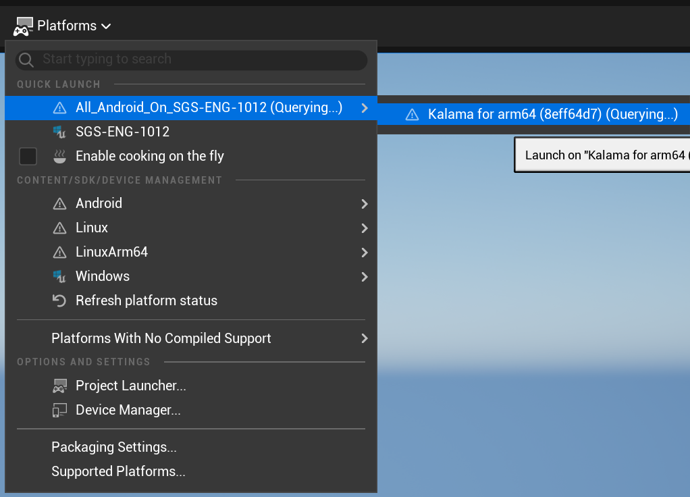
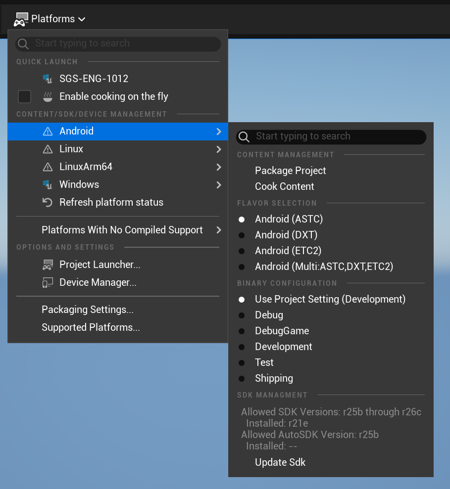
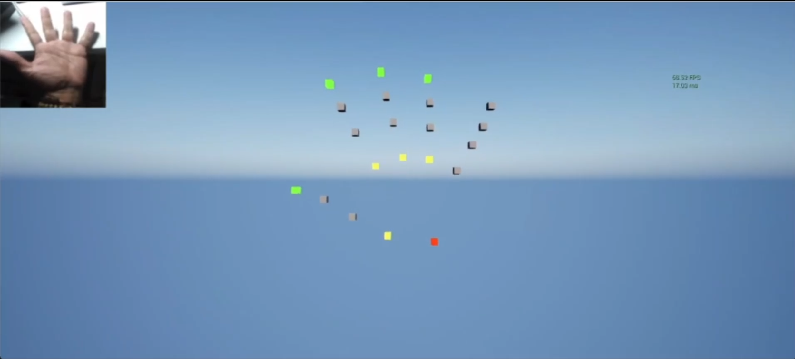
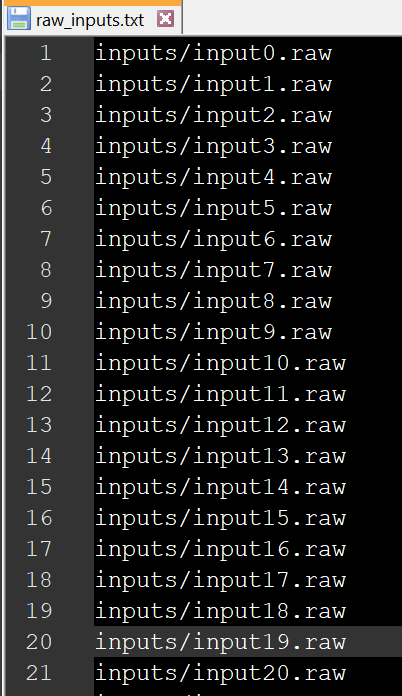

# Running AI models on Snapdragon powered devices with Unreal engine and Qualcomm's AI Stack NNE Plugin

## Introduction

This tutorial demonstrates how to load and deploy AI models in Unreal Engine applications on devices powered by Snapdragon NPUs utilizing Unreal’s NNE Framework and **Qualcomm’s NNE Runtime Plugin**.

With Qualcomm’s NNE Runtime Plugin, which integrates **Qualcomm’s AI Stack**, you will implement a hand-tracking demo and deploy it to a Snapdragon-powered device. You will grab the model available on Qualcomm's AI-Hub collection, convert it and load it in an Unreal project.

The tutorial covers, step-by-step, how to:

- Load the SNPE runtime
- Load the network model
- Create the model instance
- Feed image data
- Run inference
- Gather and use the output

By the end of this tutorial, you’ll be equipped to integrate your own neural network models into your Unreal Project and deploy them on Snapdragon-powered devices.

## Getting Ready

- Download the Qualcomm Neural Processing SDK (previously known as the SNPE SDK) from [here](https://www.qualcomm.com/developer/software/neural-processing-sdk-for-ai). This is a compressed file, Unzip it in a directory of your choice.

-  For the conversion process and quantization, you will need to use tools provided by the SDK only available in Linux to the date, so you will need to install WSL on your windows machine. Follow these instructions: [WSL installation](https://learn.microsoft.com/en-us/windows/wsl/install)

- Once installed WSL run it and install the environment to run the Neural Processing SDK on linux. Follow these instructions to do that: [Qualcomm Neural Processing SDK setup](https://docs.qualcomm.com/bundle/publicresource/topics/80-63442-2/setup.html#linux-platform-dependencies)

-  Install the latest Android SDK and NDK.

## HandTracking Demo Project

- HandTracking project files are located under samples folder.

- Clone the upstream repo and add this plugin as an engine plugin or project plugin.
[Plugins/SNPE](https://github.com/SnapdragonStudios/snapdragon-game-plugins-for-unreal-engine/tree/engine/5.4/Plugins/SNPE) 


- SNPELibrarySetup.bat is provided to copy the necessary include and library files from the downloaded SNPE SDK to the plugin. Use it as follows:

``` bat
.\Plugins\SNPE\Source\ThirdParty\SNPELibrary C:\Qualcomm\AIStack\SNPE\2.19.0.240124
```

- Generate the VS project to build your development editor version

### Get the Model

- Go to [Qualcomm's AI hub Hand-tracking model](https://aihub.qualcomm.com/mobile/models/mediapipe_hand?domain=Computer+Vision&useCase=Object+Detection) page. You will see that this model is available in Tensorflow lite format.



- [Optional] Click in see more metrics to get more detailed information about the model, like the supported phones, the input type and dimension, the output format and dimensions.



- Select MediaPipeHandLandmarkDetector. Click download model.

## Model Conversion

Now you will need to convert the model to dlc. If you want the better performance, you will need to quantize the model as well.

- Go to WSL. Make sure you have the environment variables pointing to the SNPE directories by running: 

```sh
> source .[PATH_TO_SNPE_DIRECTORY]/bin/envsetup.sh
```

- Activate the virtual environment you created when you did the setup of Qualcomm Neural Processing SDK:

- Run the conversion script from tflite to dlc as follows:

```sh
> $SNPE_ROOT/bin/x86_64-linux-clang/snpe-tflite-to-dlc --input_network [PATH_TO_MODEL_LOCATION]/mediapipe_hand-mediapipehandlandmarkdetector.tflite --output_path [PATH_TO_MODEL_LOCATION]/mediapipe_hand-mediapipehandlandmarkdetector.dlc
```

here you will have a model that you can use with the Neural Processing SDK with the same data format as the original float32.

## Using the DLC model in Unreal

1\. Drag and drop the newly converted model to the content window in Unreal engine, and take note of its path.

Now you can load this model from code or blueprints.

### Loading

Open the project solution in visual studio.

NOTE: As you saw in the model specifications you will need to provide an image in raw format tensors of float32[1 256,256,3], so a preprocessing and re-dimensioning of the camera capture needs to be done. In this tutorial we don't explain the processing, but you can go through the code to see how it is done in this particular case.

In the project there is a subsystem created to support the hand tracking. Open the file _HandtrackingSubsystem.cpp_. The loading of the model will be done in the initialize function.

To start you need to load the model from the content, and get the runtime **NNERuntimeSNPE**.  Include this block of code in the function -
```cpp
void UHandTrackingSubsystem::Initialize(FSubsystemCollectionBase& Collection)
```

```cpp
void UHandTrackingSubsystem::Initialize(FSubsystemCollectionBase& Collection)
{
	UNNEModelData* ModelData = LoadObject<UNNEModelData>(nullptr, TEXT("[YOUR CONTENT PATH TO THE MODEL]/mediapipe_hand-mediapipehandlandmarkdetector.mediapipe_hand-mediapipehandlandmarkdetector"));
	runtime = UE::NNE::GetRuntime<INNERuntimeCPU>(TEXT("NNERuntimeSNPE"));
	if (ensureMsgf(runtime.IsValid(), TEXT("Could not find requested NNE Runtime")) &&
		ensureMsgf(ModelData != nullptr, TEXT("Couldn't find Model")))
	{

	}
}
```

The LoadObject reads the model from the ModelData on your content. Remember to replace the suggested path to your actual path to the model on your content directory. 

Qualcomm's runtime inherits from **INNERuntimeCPU**, so you can retrieve it by name, with the GetRuntime function.

Now you need to create the model and a model instance using the NNE functions for that purpose.

Inside the if sentence you just added (the one with the ensureMsgf verification, add these couple of lines:

```cpp
// load the model
Model = runtime->CreateModelCPU(ModelData);
// create model instance
ModelInstance = Model->CreateModelInstanceCPU();
```

Next you will need to call a function to initialize the input tensor shape. The purpose of this function is to re-dimension the model Input but Qualcomm Neural processing SDK supports re-dimensioning only on creation of the model, but not after creation. So this function needs to be called with the actual dimensions of the model. (NOTE: Although dynamic re-dimension is not supported at the moment, it will be a future feature on our runtime plugin)

```cpp
// initialize
ModelInstance->SetInputTensorShapes(ModelInstance->GetInputTensorShapes());
```

With NNE the actual data input and output is feed via Input and Output bindings which contains pointer to the actual data memory area. So next you will need to initialize the input and output data buffers and allocate the memory for the input and output data, that you will pass as parameters to the inference function later on. These will be passed to the inference function via NNE input and output bindings.

First initialize the memory for the input data and set up the input bindings:

```cpp
// allocate image buffers
// intermediate color data
tmpColorData.SetNum(kImageSize * kImageSize);
// planar format
rawPixels.SetNum(kImageSize * kImageSize * 3);

//setup input bindings
InputBinding.SetNum(1);
InputBinding[0] = { .Data = rawPixels.GetData(), .SizeInBytes = rawPixels.Num() * sizeof(float) };
```

Next the memory and bindings for the output data:

```cpp
// allocate output buffers, setup output bindings
const auto& OutputTensorDescs = ModelInstance->GetOutputTensorDescs();
int NumOutputs = OutputTensorDescs.Num();
outputs.SetNum(NumOutputs);
OutputBinding.SetNum(NumOutputs);
for (int OutputIndex = 0; OutputIndex < NumOutputs; ++OutputIndex)
{
	const auto& OutputTensorName = OutputTensorDescs[OutputIndex].GetName();
	auto& OutputBuffer = outputs[OutputIndex];
	auto& Binding = OutputBinding[OutputIndex];

	if (OutputTensorName == "scores")
	{
		// accuracy
		accOutputIndex = OutputIndex;
		OutputBuffer.SetNum(1);
	}
	else if (OutputTensorName == "lr")
	{
		// handedness (left/right)
		OutputBuffer.SetNum(1);
	}
	else if (OutputTensorName == "landmarks")
	{
		// trackers xyz
		landmarkOutputIndex = OutputIndex;
		OutputBuffer.SetNum(kNumTrackers * 3);
	}

	Binding.Data = OutputBuffer.GetData();
	Binding.SizeInBytes = OutputBuffer.Num() * sizeof(float);
}

trackers.SetNum(kNumTrackers);
```

In conclusion your Initialize function should look like this:

```cpp
void UHandTrackingSubsystem::Initialize(FSubsystemCollectionBase& Collection)
{
	UNNEModelData* ModelData = LoadObject<UNNEModelData>(nullptr, TEXT("[PATH_TO_MODELDATA]/mediapipe_hand-mediapipehandlandmarkdetector.mediapipe_hand-mediapipehandlandmarkdetector"));
	runtime = UE::NNE::GetRuntime<INNERuntimeCPU>(TEXT("NNERuntimeSNPE"));
	if (ensureMsgf(runtime.IsValid(), TEXT("Could not find requested NNE Runtime")) &&
		ensureMsgf(ModelData != nullptr, TEXT("Couldn't find Model")))
	{
		// load the model
		Model = runtime->CreateModelCPU(ModelData);
		// create model instance
		ModelInstance = Model->CreateModelInstanceCPU();
		// initialize
		ModelInstance->SetInputTensorShapes(ModelInstance->GetInputTensorShapes());

		// allocate image buffers
		// intermediate color data
		tmpColorData.SetNum(kImageSize * kImageSize);
		// planar format
		rawPixels.SetNum(kImageSize * kImageSize * 3);

		//setup input bindings
		InputBinding.SetNum(1);
		InputBinding[0] = { .Data = rawPixels.GetData(), .SizeInBytes = rawPixels.Num() * sizeof(float) };
		
		// allocate output buffers, setup output bindings
		const auto& OutputTensorDescs = ModelInstance->GetOutputTensorDescs();
		int NumOutputs = OutputTensorDescs.Num();
		outputs.SetNum(NumOutputs);
		OutputBinding.SetNum(NumOutputs);
		for (int OutputIndex = 0; OutputIndex < NumOutputs; ++OutputIndex)
		{
			const auto& OutputTensorName = OutputTensorDescs[OutputIndex].GetName();
			auto& OutputBuffer = outputs[OutputIndex];
			auto& Binding = OutputBinding[OutputIndex];

			if (OutputTensorName == "scores")
			{
				// accuracy
				accOutputIndex = OutputIndex;
				OutputBuffer.SetNum(1);
			}
			else if (OutputTensorName == "lr")
			{
				// handedness (left/right)
				OutputBuffer.SetNum(1);
			}
			else if (OutputTensorName == "landmarks")
			{
				// trackers xyz
				landmarkOutputIndex = OutputIndex;
				OutputBuffer.SetNum(kNumTrackers * 3);
			}

			Binding.Data = OutputBuffer.GetData();
			Binding.SizeInBytes = OutputBuffer.Num() * sizeof(float);
		}

		trackers.SetNum(kNumTrackers);
	}
}
```

### Run Inference

Inference is performed in the function 
````
void UHandTrackingSubsystem::Process(UTextureRenderTarget2D* renderTarget2D).
````
The main instruction is RunSync and you pass as parameter the InputBinding and OutputBinding created in the initialize function.

The next part of the code consists of verifying the validity(accuracy) of each node output and reading the inferred position.

Add the following code so you Process function looks like this.

```cpp
if (renderTarget2D != nullptr)
{
	ExtractRawPixels(renderTarget2D, tmpColorData, rawPixels);
	UE::NNE::IModelInstanceCPU::ERunSyncStatus result = ModelInstance->RunSync(InputBinding, OutputBinding);
	accuracy = outputs[accOutputIndex][0];
	for (int i = 0; i < kNumTrackers; i++)
	{
		float X = outputs[landmarkOutputIndex][i * 3 + 0];
		float Y = outputs[landmarkOutputIndex][i * 3 + 1];
		float Z = outputs[landmarkOutputIndex][i * 3 + 2];

		trackers[i].X = (Z);
		trackers[i].Y = (X - 0.5f);
		trackers[i].Z = -(Y - 0.5f);
	}
}
```

Compile and build your project. 

## Running the project

Open the project in the unreal editor, you can run the solution on the editor if you have a camera connected to your computer.

Make sure that you have the android SDK and NDK correctly specified in the Platform/Android SDK section of the properties.



Android SDK settings

Now you can deploy the application to the phone either with Quick launch or packaging the project for android.



Quick Launch



Package Project

If you packaged the project, you could run the install batch file generated to install the application into your phone.

Enjoy.



HandTrack App

## Quantization

The process of quantization will allow you to reduce the memory footprint of the model by changing the representation from floating point to INT8, having a model with the same functionality with a much smaller size. This operation also increases execution speed on the NPU by not having to process a dynamic quantization internally when loading the model and running inference.

To quantize the model, you need to provide a file that contains the paths to the images you will use as samples for the calibration of the model, these images should be in raw format.



input data samples list

For this you will have to go to WSL and use the tools are available on linux from the Qualcomm Neural Processing SDK.

Run this function, passing as argument the original dlc file, a text file that contains a list of input data samples to use in the quantization process and the destination file.

```sh
>$SNPE_ROOT/bin/x86_64-linux-clang/snpe-dlc-quant --input_dlc mediapipe_hand-mediapipehandlandmarkdetector.dlc --input_list raw_inputs.txt --output_dlc mediapipe_hand-mediapipehandlandmarkdetector-quantized.dlc
```

Now you can use the quantized result file in Unreal engine as described on the stapes before.
