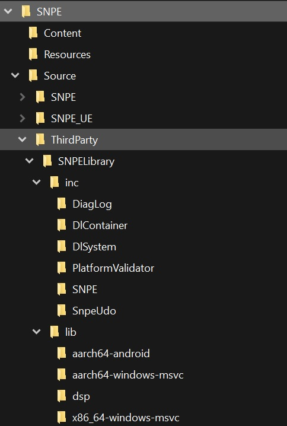

# Snapdragon™ Game Plugins for Unreal Engine

### Table of contents
- [Snapdragon™ Game Plugins for Unreal Engine](#snapdragon-game-plugins-for-unreal-engine)
	- [Table of contents](#table-of-contents)
- [Introduction](#introduction)
- [Usage Instructions](#usage-instructions)
- [List of Plugins](#list-of-plugins)
	- [Snapdragon™ Game Super Resolution](#snapdragon-game-super-resolution)
	- [Qualcomm™ NPE Plugin](#qualcomm-npe-plugin)
		- [Instructions](#instructions)
- [License](#license)

# Introduction

This repository is a collection of plugins for the Unreal Engine, developed and authored by the Snapdragon™ Studios team.

This component is part of the [Snapdragon™ Game Toolkit](https://developer.qualcomm.com/gametoolkit).

# Usage Instructions

Unreal Engine contains multiple major versions, some released a few years ago but still used by many developers and game studios. Because of this, our repository is structured to provide plugins on a similar way:

- Select your major engine version in one of the branches in this repository
- Plugins are always contained in the "Plugins" directory
- Follow any extra instructions contained at the plugin of your choice

Note: The plugins are normally just drag and drop, and usually they can all be used as both an engine and project plugins, exceptions and extra instructions will be listed on the plugin readme, inside its own folder, if any.

# List of Plugins

## Snapdragon™ Game Super Resolution 

*Available Versions:*
| [4.27](https://github.com/quic/snapdragon-game-plugins-for-unreal-engine/tree/engine/4.27/Plugins/SGSR) | [5.0](https://github.com/quic/snapdragon-game-plugins-for-unreal-engine/tree/engine/5.0/Plugins/SGSR) | [5.1](https://github.com/quic/snapdragon-game-plugins-for-unreal-engine/tree/engine/5.1/Plugins/SGSR) | [5.2](https://github.com/quic/snapdragon-game-plugins-for-unreal-engine/tree/engine/5.2/Plugins/SGSR) | 
|------|-----|-----|-----|

Snapdragon™ Game Studios developed Snapdragon™ Game Super Resolution (Snapdragon™ GSR or SGSR), which integrates upscaling and sharpening in one single GPU shader pass. The algorithm uses a 12-tap Lanczos-like scaling filter and adaptive sharpening filter, which presents smooth images and sharp edges.

Our solution provides an efficient solution for games to draw 2D UI at device resolution for better visual quality, while rendering the 3D scene at a lower resolution for performance and power savings.

The technique has visual quality on par with other spatial upscaling techniques while being highly optimized for Adreno™ GPU hardware.

More information can be found at https://github.com/quic/snapdragon-gsr

## Qualcomm™ NPE Plugin 

*Available Versions:*
| [5.3](https://github.com/quic/snapdragon-game-plugins-for-unreal-engine/tree/engine/5.3/Plugins/SNPE) | 
|------|

Qualcomm™ Game Studios developed Qualcomm™ NPE Plugin, which integrates Qualcomm's Neural Processing SDK to Unreal Engine and provides C++ and blueprint functionality to load, DLC models and run inference with them using either CPU, GPU or the device's HTP.

### Instructions

1. Clone or download the plugin ("SNPE")
2. Copy the plugin to the project's plugin folder.
3. Download Qualcomm's Neural Processing SDK from [Qualcomm™ Neural Processing SDK](https://developer.qualcomm.com/software/qualcomm-neural-processing-sdk) , Make sure to download the Windows and Linux version and selecting a version higher or equal to 2.14
4. From the installed Neural Processing SDK directory **copy** the contents of *"\AIStack\SNPE\[version]\include\SNPE"* to *"[project path]\plugins\SNPE\Source\ThirdParty\SNPELibrary\inc"*
5. To build for Android. From the installed Neural Processing SDK directory:
	**- copy** the folder of *"\AIStack\SNPE\[version]\include\lib\aarch64-android"* to *"[project path]\plugins\SNPE\Source\ThirdParty\SNPELibrary\lib\"*
6. For the windows x86-64 build (and the editor), From the installed Neural Processing SDK directory:
	**- copy** the contents of *"\AIStack\SNPE\[version]\include\lib\x86_64-windows-msvc"* to *"[project path]\plugins\SNPE\Source\ThirdParty\SNPELibrary\lib\"*
7. For the windows ARM64 build and Windows on Snapdragon systems, From the installed Neural Processing SDK directory:
	**- copy** the contents of *"\AIStack\SNPE\[version]\include\lib\aarch64-windows-msvc"* to *"[project path]\plugins\SNPE\Source\ThirdParty\SNPELibrary\lib\"*
	**- copy** the files *msvcp140.dll* and *vcruntime140.dll* (this must be supplied with your VS installation) to *"[project path]\plugins\SNPE\Source\ThirdParty\SNPELibrary\lib\aarch64-windows-msvc\"*
8. To run on DSP, HTP you need to **copy** the content of the specific library of your device to *"[project path]\plugins\SNPE\Source\ThirdParty\SNPELibrary\lib\dsp\"* those can be *"\AIStack\SNPE\[version]\include\lib\[hexagon-v73 | hexagon-v68 | hexagon-v66]"*. But if you are not sure of the model you can copy the content of the 3 directories.
9. Your *"[project path]\plugins\SNPE\Source\ThirdParty\SNPELibrary\lib\"* must now look like:

More information can be found at "*[project path]\plugins\SNPE\SNPE* UE plugin blueprint reference.pdf"

# License

Snapdragon™ Game Super Resolution is licensed under the BSD 3-clause “New” or “Revised” License. Check out the [LICENSE](LICENSE) for more details.