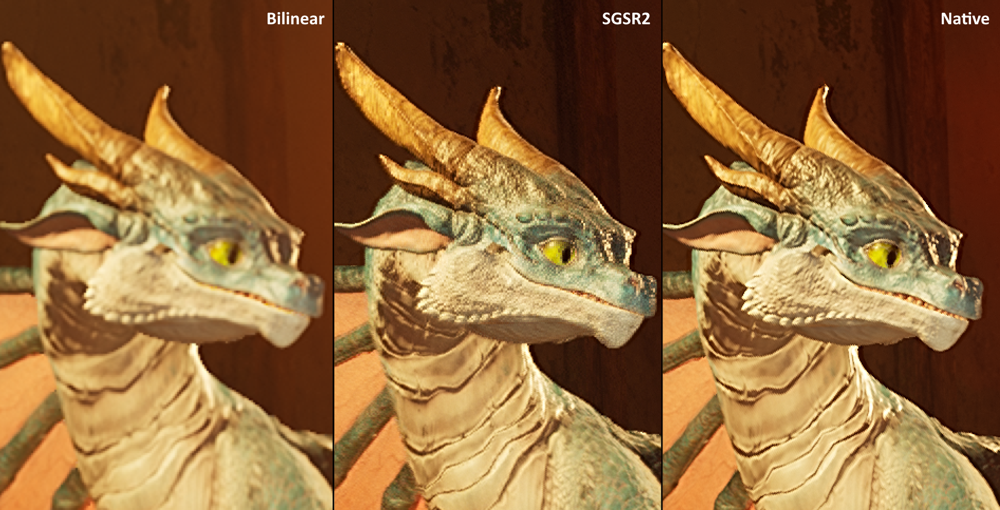

# Snapdragon™ Game Plugins for Unreal Engine

### Table of contents
- [Snapdragon™ Game Plugins for Unreal Engine](#snapdragon-game-plugins-for-unreal-engine)
		- [Table of contents](#table-of-contents)
- [Introduction](#introduction)
- [Usage Instructions](#usage-instructions)
- [List of Plugins](#list-of-plugins)
	- [Snapdragon™ Game Super Resolution 1](#snapdragon-game-super-resolution-1)
	- [Snapdragon™ Game Super Resolution 2](#snapdragon-game-super-resolution-2)
	- [Qualcomm™ NPE Plugin](#qualcomm-npe-plugin)
- [License](#license)

# Introduction

This repository is a collection of plugins for the Unreal Engine, developed and authored by the Snapdragon™ Studios team.

This component is part of the [Snapdragon™ Game Toolkit](https://www.qualcomm.com/developer/snapdragon-game-toolkit).

# Usage Instructions

Unreal Engine contains multiple major versions, some released a few years ago but still used by many developers and game studios. Because of this, our repository is structured to provide plugins on a similar way:

- Select your major engine version in one of the branches in this repository
- Plugins are always contained in the "Plugins" directory
- Follow any extra instructions contained at the plugin of your choice

Note: The plugins are normally just drag and drop, and usually they can all be used as both an engine and project plugins, exceptions and extra instructions will be listed on the plugin readme, inside its own folder, if any.

# List of Plugins

## Snapdragon™ Game Super Resolution 1

*Available Engine Versions:*
| [4.27](https://github.com/quic/snapdragon-game-plugins-for-unreal-engine/tree/engine/4.27/Plugins/SGSR) | [5.0](https://github.com/quic/snapdragon-game-plugins-for-unreal-engine/tree/engine/5.0/Plugins/SGSR) | [5.1](https://github.com/quic/snapdragon-game-plugins-for-unreal-engine/tree/engine/5.1/Plugins/SGSR) | [5.2](https://github.com/quic/snapdragon-game-plugins-for-unreal-engine/tree/engine/5.2/Plugins/SGSR) | [5.5](https://github.com/quic/snapdragon-game-plugins-for-unreal-engine/tree/engine/5.5/Plugins/SGSR) |
|------|-----|-----|-----|-----|

Snapdragon™ Game Studios developed Snapdragon™ Game Super Resolution 1 (Snapdragon™ GSR 1 or SGSR1), which integrates upscaling and sharpening in one single GPU shader pass. The algorithm uses a 12-tap Lanczos-like scaling filter and adaptive sharpening filter, which presents smooth images and sharp edges.

Our solution provides an efficient solution for games to draw 2D UI at device resolution for better visual quality, while rendering the 3D scene at a lower resolution for performance and power savings.

The technique has visual quality on par with other spatial upscaling techniques while being highly optimized for Adreno™ GPU hardware.

For more information about the upscaler (and standalone shaders), please take a look at our [Snapdragon Game Super Resolution](https://github.com/quic/snapdragon-gsr) repository.

## Snapdragon™ Game Super Resolution 2

*Available Engine Versions:*
| [4.27](https://github.com/quic/snapdragon-game-plugins-for-unreal-engine/tree/engine/4.27/Plugins/SGSR2) | [5.1](https://github.com/quic/snapdragon-game-plugins-for-unreal-engine/tree/engine/5.1/Plugins/SGSR2) | [5.2](https://github.com/quic/snapdragon-game-plugins-for-unreal-engine/tree/engine/5.2/Plugins/SGSR2) | [5.4](https://github.com/quic/snapdragon-game-plugins-for-unreal-engine/tree/engine/5.4/Plugins/SGSR2) | [5.5](https://github.com/quic/snapdragon-game-plugins-for-unreal-engine/tree/engine/5.5/Plugins/SGSR2) |
|------|-----|-----|-----|-----|

 

Snapdragon™ Game Super Resolution 2 (Snapdragon™ GSR 2 or just SGSR 2) was developed by Qualcomm Snapdragon™ Game Studios; it's our temporal upscaling solution optimized for Adreno GPUs.

Snapdragon™ GSR 2 strikes a better balance between performance and visual quality on mobile devices than other temporal upscaling methods. Its main goal is to improve the quality of the final image by reducing aliasing, flicker, and ghosting while increasing image resolution.

By comparison, TAAU is a simple and fast upscaling version of TAA. It tends to do a good job of reducing aliasing in moving images but also amplifies TAA's shortcomings, such as ghosting. Other alternatives have been developed to produce better perceptual visual quality than TAAU, but these are notoriously slow on mobile GPUs, often introducing compute shader bottlenecks and consuming a lot of power.

Snapdragon™ GSR 2 is an improvement on all fronts, ensuring applications retain their visual fidelity while being easy on power consumption.

 
 

For more information about the upscaler (and standalone shaders), please take a look at our [Snapdragon Game Super Resolution](https://github.com/quic/snapdragon-gsr) repository.

## Qualcomm™ NPE Plugin 

*Available Engine Versions:*
| [5.3](https://github.com/quic/snapdragon-game-plugins-for-unreal-engine/tree/engine/5.3/Plugins/SNPE) | [5.4](https://github.com/quic/snapdragon-game-plugins-for-unreal-engine/tree/engine/5.4/Plugins/SNPE) |
|------|------|

Plugin for Neural Network Inference using the Qualcomm™ Neural Processing SDK (also known as SNPE).

This plugin enables hardware acceleration of AI model inference on devices with Qualcomm® Hexagon™ Processors.

# License

Snapdragon™ Game Super Resolution is licensed under the BSD 3-clause “New” or “Revised” License. Check out the [LICENSE](LICENSE) for more details.
